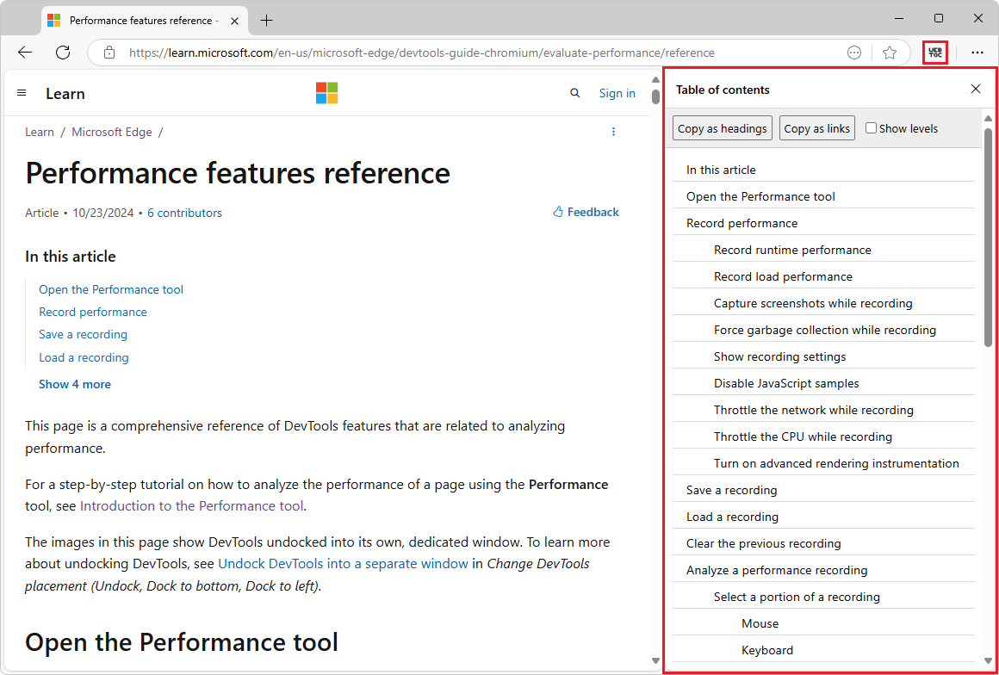
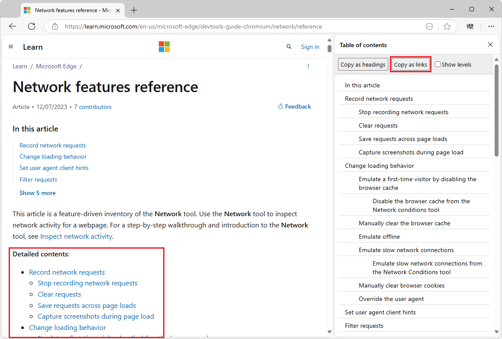

# WebToc - A table of contents extractor in your browser

WebToc displays the table of contents (TOC) outline for the current webpage, in the sidebar as you surf the web.  WebToc is a browser sidebar extension that generates a table of contents from the h1 through h6 tags in the current webpage.



**Contents:**
* [Capabilities and features](#capabilities-and-features)
* [Install WebToc](#install-webtoc)
   * [Clone the WebToc repo to your local drive](#clone-the-webtoc-repo-to-your-local-drive)
   * [Install WebToc from the cloned repo](#install-webtoc-from-the-cloned-repo)
   * [Pin the WebToc button to the toolbar](#pin-the-webtoc-button-to-the-toolbar)
* [Use WebToc](#use-webtoc)
   * [Display the table of contents for the current tab](#display-the-table-of-contents-for-the-current-tab)
   * [Show the heading level number next to each heading](#show-the-heading-level-number-next-to-each-heading)
   * [Compare the TOCs of multiple webpages simultaneously](#compare-the-tocs-of-multiple-webpages-simultaneously)
   * [Copy the TOC as headings](#copy-the-toc-as-headings)
   * [Copy the TOC as links](#copy-the-toc-as-links)
* [Website-specific behavior](#website-specific-behavior)
* [See also](#see-also)


<!-- ====================================================================== -->
## Capabilities and features

WebToc's capabilities and features include:

* View all headings of the current webpage, as a nested outline.
   * Quickly jump around within the webpage.
* Optionally display the heading level numbers, including arbitrary skipping of levels.
* Compare the headings structure of multiple webpages simultaneously.
   * Works in Microsoft Edge, Google Chrome, and their preview channels.
* Copy the TOC as Markdown headings.
* Copy the TOC as a list of Markdown links, to add Contents navigation within a webpage.


<!-- ====================================================================== -->
## Install WebToc

To install WebToc:

1. [Clone the WebToc repo to your local drive](#clone-the-webtoc-repo-to-your-local-drive).
1. [Install WebToc from the cloned repo](#install-webtoc-from-the-cloned-repo).
1. [Pin the WebToc button to the toolbar](#pin-the-webtoc-button-to-the-toolbar).

Details are below.


<!-- ------------------------------ -->
### Clone the WebToc repo to your local drive

To clone this repo to your local drive:

1. Click the **Code** drop-down button above (https://github.com/captainbrosset/WebToc).

1. Click the **Copy url to clipboard** button.

   The URL is copied to the clipboard: `https://github.com/captainbrosset/WebToc.git`

   Or, if you have GitHub Desktop installed, click **Open with GitHub Desktop** to clone the repo, and skip the command prompt step below.

   Or, you can use Visual Studio Code's **Source Control** pane to clone the repo, and skip the command prompt step below.

1. Assuming you have git installed, open a command prompt.

1. Clone the repo to your local drive, entering the URL string that you copied from the GitHub repo.  If you use a command prompt:

   ```Shell
   # example location where the repo directory will be added:
   cd c:/users/localAccount/github/
   git clone https://github.com/captainbrosset/WebToc.git
   ```

For details about cloning a repo, see:
* [Cloning a repository](https://docs.github.com/en/repositories/creating-and-managing-repositories/cloning-a-repository) - GitHub docs.


<!-- ------------------------------ -->
### Install WebToc from the cloned repo

To install WebToc in the browser from the locally cloned repo:

1. In Microsoft Edge, click **Settings and more** in the upper right, click **Extensions** , and then click **Manage extensions**.

   Or, in Chrome, click **Customize and control Google Chrome** in the upper right, click **Extensions**, and then click **Manage Extensions**.

   The **Extensions** tab opens.

1. Turn on the **Developer mode** toggle on the left (Microsoft Edge) or in the upper right (Chrome).

1. Click the **Load unpacked** button.

   The **Select the extension directory** dialog opens.

1. Navigate to your clone of the repo, such as:

   `C:\Users\localAccount\GitHub\WebToc\`

1. Click the **Select Folder** button.

   The extension is listed in the **Extensions** tab.

Next, pin the WebToc button to the toolbar, as follows.


<!-- ------------------------------ -->
### Pin the WebToc button to the toolbar

1. Open a new tab.

1. Close the **Extensions** tab.

1. In Microsoft Edge, click **Settings and more** in the upper right, click **Extensions**, and then to the right of **WebToc: Table of contents**, click the **Pin to toolbar** button.  Then click in a blank area to close the pop-up.

   Or, in Chrome, click the **Extensions** button to the right of the Address bar, and then to the right of **WebToc: Table of contents**, click the **Pin** button.  Then click in a blank area to close the pop-up.

   The **WebToc** () button is displayed to the right of the Address bar.


<!-- ====================================================================== -->
## Use WebToc

After WebToc is installed, use the tool as follows.


<!-- ------------------------------ -->
### Display the table of contents for the current tab

1. Go to a webpage, such as the present webpage.

1. If the **WebToc** () button is not shown to the right of the Address bar, see [Pin the WebToc button to the toolbar](#pin-the-webtoc-button-to-the-toolbar), above.

1. Click the **WebToc** () button to the right of the Address bar.

1. Go to a webpage.  

1. Refresh the webpage (**F5**).

   The TOC is displayed in the sidebar of the browser.

   All Markdown levels are displayed (h1-h6).

1. Click a heading in the table of contents to scroll to the heading in the webpage.


<!-- ------------------------------ -->
### Show the heading level number next to each heading

* Select the **Show levels** checkbox.

  The heading level such as **h2** is displayed to the left of each heading in the TOC:

  

  This example shows **h2**, **h4**, and **h6** headings, showing that WebToc handles arbitrary heading levels.


<!-- ------------------------------ -->
### Compare the TOCs of multiple webpages simultaneously

You can open two different browsers side-by-side, and independently **Refresh** each browser to update the WebToc display.

To use WebToc to compare multiple webpages simultaneously:

1. Open multiple different browsers, such as:

   * Microsoft Edge (stable release).
   * Edge Beta preview channel (updated monthly).
   * Edge Dev preview channel (updated weekly).
   * Edge Canary preview channel (updated daily).
   * Google Chrome (stable, Beta, Dev, or Canary).

1. Install WebToc in each different browser, from the cloned (or downloaded) WebToc repo; see [Install WebToc from the cloned repo](#install-webtoc-from-the-cloned-repo), above.

1. Refresh each browser.

   In the sidebar of each browser, the TOC is independently updated.

To download a preview channel of Microsoft Edge (Beta, Dev, or Canary), see [Become a Microsoft Edge Insider](https://aka.ms/microsoftedge).


<!-- ------------------------------ -->
### Copy the TOC as headings

You can copy the TOC as a Markdown headings outline.  The **Copy as headings** button creates a nested list of headings in Markdown, which you can use for general-purpose doc-design, such as comparing docs and re-outlining.

1. Click the **Copy as headings** button.<!-- https://learn.microsoft.com/microsoft-edge/devtools-guide-chromium/network/reference -->

   The TOC is copied to the clipboard as a nested list of Markdown headings.

1. Paste into an editor, such as Visual Studio Code.

   For example:

   ```md
   ## Record network requests
      #### Stop recording network requests
      #### Clear requests
      #### Save requests across page loads
      #### Capture screenshots during page load
   ## Change loading behavior
      #### Emulate a first-time visitor by disabling the browser cache
            ###### Disable the browser cache from the Network conditions tool
      #### Manually clear the browser cache
   ## See also
   ```

   This example shows **h2**, **h4**, and **h6** headings, showing that WebToc handles arbitrary heading levels.


<!-- ------------------------------ -->
### Copy the TOC as links

You can copy the TOC as a list of Markdown links, to add Contents navigation within a webpage.  This provides a webpage or article TOC.<!-- _local TOC_, _partial TOC_ -->

1. Click the **Copy as links** button.<!-- https://learn.microsoft.com/microsoft-edge/devtools-guide-chromium/network/reference -->

   The TOC is copied to the clipboard as a nested list of anchor links, in Markdown format.

1. Paste the links into a `.md` file in an editor, such as Visual Studio Code.

   ```md
   **Contents:**
   * [Record network requests](#record-network-requests)
      * [Stop recording network requests](#stop-recording-network-requests)
      * [Clear requests](#clear-requests)
      * [Save requests across page loads](#save-requests-across-page-loads)
      * [Capture screenshots during page load](#capture-screenshots-during-page-load)
   * [Change loading behavior](#change-loading-behavior)
      * [Emulate a first-time visitor by disabling the browser cache](#emulate-a-first-time-visitor-by-disabling-the-browser-cache)
         * [Disable the browser cache from the Network conditions tool](#disable-the-browser-cache-from-the-network-conditions-tool)
      * [Manually clear the browser cache](#manually-clear-the-browser-cache)
   * [See also](#see-also)
   ```

1. Above the list of links, add a lead-in, such as `**Contents:**`.

1. View your`.md` file in a Markdown preview tool, such as a `Readme.md` file in a GitHub repo.

   The body of the webpage shows the rendered list of links.

1. Optionally convert your `.md` file to a `.html` file on a web server, and then view the webpage:

   <!-- don't use present Readme as an example; too meta -->


<!-- ====================================================================== -->
## Website-specific behavior

For the following websites, WebToc omits the extra headings at the top and bottom of the webpage:

* [github.com](https://github.com) - GitHub preview of Markdown files.
* [learn.microsoft.com](https://learn.microsoft.com) - Microsoft Dev docs.<!-- & https://review.learn.microsoft.com -->
* [developer.chrome.com](https://developer.chrome.com) - Chrome Dev docs.


<!-- ====================================================================== -->
## See also

* [Everything to know about browser extensions](https://www.microsoft.com/edge/learning-center/everything-to-know-about-browser-extensions) - introduction for users.
* [Add, turn off, or remove extensions in Microsoft Edge](https://support.microsoft.com/microsoft-edge/add-turn-off-or-remove-extensions-in-microsoft-edge-9c0ec68c-2fbc-2f2c-9ff0-bdc76f46b026) - support steps for users.
* [Sideload an extension to install and test it locally](https://learn.microsoft.com/microsoft-edge/extensions-chromium/getting-started/extension-sideloading)
